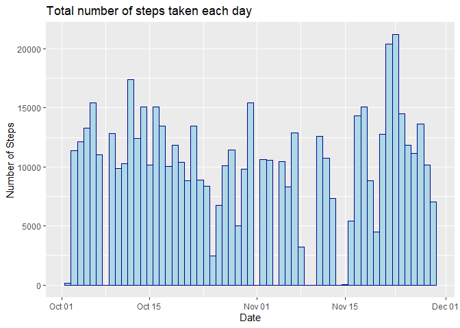
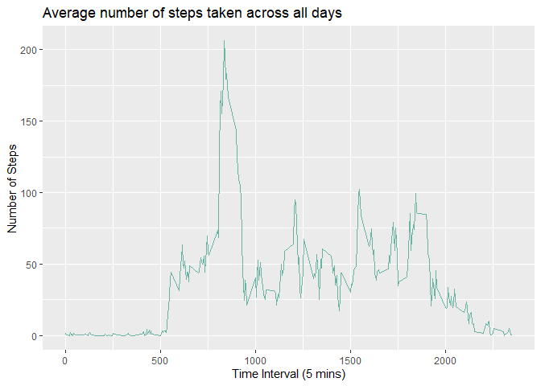
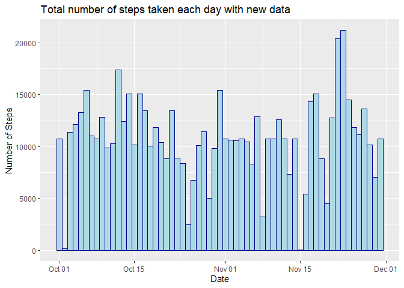
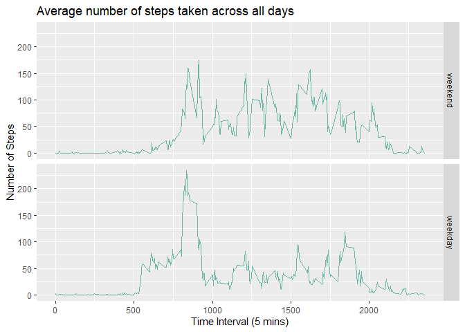

## Loading and preprocessing the data

```r
library(dplyr)
library(ggplot2)

#Read table 
data <- read.table(unz("activity.zip", "activity.csv"), header=T, quote="\"", sep="," , na.strings = "NA")
data$date <- as.Date(data$date,format = "%Y-%m-%d")
```

## Histogram of the total number of steps taken each day

```r
#Calculate the total number of steps taken per day
TotalNumPerDay <- 
    data %>% 
    group_by(date)%>%
    summarise(TotalStep = sum(steps,na.rm = TRUE))

#Construct data for histogram
Histlst <- rep(TotalNumPerDay$date,TotalNumPerDay$TotalStep)
Histdf <- data.frame("date" = Histlst, "num" = rep(1,length(Histlst)), stringsAsFactors = FALSE)

#Plot histogram
ggplot(Histdf, aes(x=date)) + 
    geom_histogram(binwidth=1,color="darkblue", fill="lightblue") + 
    labs(title="Total number of steps taken each day",x="Date", y = "Number of Steps")
```

<!-- -->

## What is mean total number of steps taken per day?

```r
summary(TotalNumPerDay$TotalStep)
```

```
##    Min. 1st Qu.  Median    Mean 3rd Qu.    Max. 
##       0    6778   10395    9354   12811   21194
```

## What is the average daily activity pattern?

```r
#Calculate average steps taken during each interval
Avgsteps <- 
    data %>% 
    group_by(interval)%>%
    summarise(AverageStep = mean(steps,na.rm = TRUE))

#Plot the time interval line graph
ggplot(data=Avgsteps, aes(x=interval, y=AverageStep)) + 
    geom_line(color="#69b3a2") +
    labs(title="Average number of steps taken across all days",x="Time Interval (5 mins)", y = "Number of Steps")
```

<!-- -->


```r
# Time interval on average across all the days in the dataset, contains the maximum number of steps
Avgsteps %>%
    filter(AverageStep == max(AverageStep)) %>%
    select(interval)
```

```
## # A tibble: 1 x 1
##   interval
##      <int>
## 1      835
```


## Imputing missing values

```r
#Total number of missing values
sum(!complete.cases(data))
```

```
## [1] 2304
```
#### Replace the missing value with mean for according 5-minute interval.

```r
#Create a new dataset that is equal to the original dataset but with the missing data filled in.
newdata <- merge(data,Avgsteps,by.x = "interval", by.y = "interval",all.x = TRUE, all.y = FALSE)
newdata$newsteps <- newdata$steps
newdata[is.na(newdata$newsteps),"newsteps"] <- newdata[is.na(newdata$newsteps),"AverageStep"]
```
#### Histogram of the total number of steps taken each day with new data

```r
#Calculate the total number of steps taken per day
newTotalNumPerDay <- 
    newdata %>% 
    group_by(date)%>%
    summarise(TotalStep = sum(newsteps,na.rm = TRUE))

#Construct data for histogram
newHistlst <- rep(newTotalNumPerDay$date,newTotalNumPerDay$TotalStep)
newHistdf <- data.frame("date" = newHistlst, "num" = rep(1,length(newHistlst)), stringsAsFactors = FALSE)

#Plot histogram
ggplot(newHistdf, aes(x=date)) + 
    geom_histogram(binwidth=1,color="darkblue", fill="lightblue") + 
    labs(title="Total number of steps taken each day with new data",x="Date", y = "Number of Steps")
```

<!-- -->

#### Mean and median of total number of steps taken per day after filling in all missing data

```r
summary(newTotalNumPerDay$TotalStep)
```

```
##    Min. 1st Qu.  Median    Mean 3rd Qu.    Max. 
##      41    9819   10766   10766   12811   21194
```

#### By applying strategy of filling in all missing values in database, both mean and median increased.

## Are there differences in activity patterns between weekdays and weekends?

```r
#Create a new factor variable in the dataset with two levels -- "weekday" and "weekend" indicating whether a given date is a weekday or weekend day.
weekdaylst <- c('Monday', 'Tuesday', 'Wednesday', 'Thursday', 'Friday')
data$weekdays <- factor((weekdays(data$date) %in% weekdaylst), 
         levels=c(FALSE, TRUE), labels=c('weekend', 'weekday')) 

#Calculate average steps taken during each interval separate by weekdays
weekdaysAvgsteps <- 
    data %>% 
    group_by(interval,weekdays)%>%
    summarise(AverageStep = mean(steps,na.rm = TRUE))

#Make a panel plot containing a time series plot (i.e. type = "l") of the 5-minute interval (x-axis) and the average number of steps taken, averaged across all weekday days or weekend days (y-axis).
ggplot(data=weekdaysAvgsteps, aes(x=interval, y=AverageStep)) + 
    geom_line(color="#69b3a2") +
    facet_grid(weekdays ~ .) +
    labs(title="Average number of steps taken across all days",x="Time Interval (5 mins)", y = "Number of Steps")
```

<!-- -->
